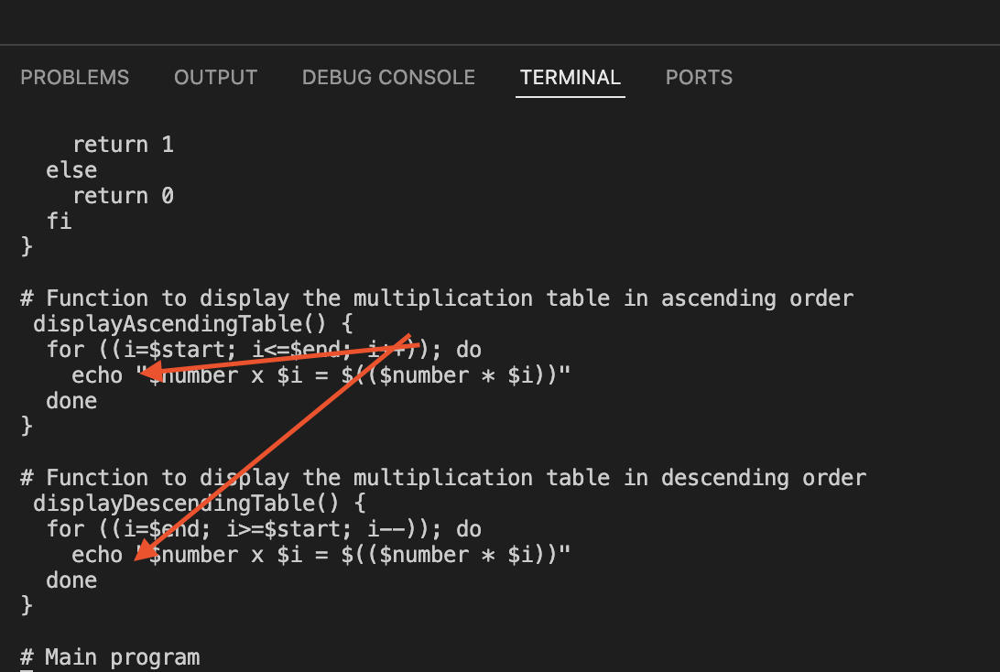

# BASH SCRIPT FOR GENERATING A MULTIPLICATION TABLE

In these project, I am creating a bash script for a multiplication table using one of the linux text editors (vim). The created bash script for the multiplication table works for any number entered by the user, as the script will prompt the user to input his/her number of choice, thereafter prompting the user to specify if they prefer a full or partial multiplication table pending the specified range, also if they prefer the table in ascending or descending order. The script validate the range input and handle invalid or out-of bound entries providing feedback to the user. I will be making use of the list form or c-style for loops, using conditional logic (if-else statement) as well as the same variable will be applied for either for loop forms.

## PROCESSES INVOLVED

A folder "Bash script multiplication table" is created in my general workspace folder housing both list form and c-sytle for loops multiplacation table respectively.

**VIM**
Vim is a linux text editor (vi or vim) - is a software application designed for creating, modifying and managing text files in a linux operating system.

The command `vim multiplication_table_bash.sh` creates a vim text file 

**SHEBANG**
Shebang is a character sequence that appears at the beginning of a script in linux or other unix-like operating system.

The command `#!/bin/bash` 

**STRINGS**
String is a sequence of characters enclosed within either double quotes (") or single quotes ('). strings in bash are essential as they are used to represent text, handling user input, variables or even data to be processed.

**OPERATORS**
Operators are symbols or keywords used to perform operations on variables and values as they are fundamental in manipulating data, controlling flow and decision making in script like( -lt, -gt ) among others.

The command `operator` 

**ARGUMENTS**
Arguments in bash scripting are values passed to a csript or a function when it is invoked, as these arguments allows you to provide input to a script at runtime.

The command `arguments` 

**PARENTHESES**
Parentheses () denotes a subshell in bash, it has different meaning depending on their type and how its been used. 

`parenthese` 

**CURLY BRACES**
Curly braces in bash scripting {} are used for command grouping, function body definitions, parameter expansions.

`curly braces` 

**SQUARE BRACKETS/ DOUBLE SQUARE BRACKETS**
Square brackets [] and double square [[]] brackets in bash scripting are used for test conditions and extended conditional tests.

`square brackets` 

**REGULAR EXPRESSION**
Regular expression (regex or re) in bash scripting are commonly used to match patterns in text, they can be sequence of character that defines a search pattern and can be used to validate input search for specific text or manipulate strings.

The command `re or regex` 

**CONDITIONAL STATEMENT**
Conditional statements in bash scripting allows you to make decision in your script based on certain conditions (true or false), commonly used conditional statements are if, if-else,if-elif-else.

The command `if,if-else` 

**PIPING**
Piping in bash scripting refers to the process of passing the output of one command as the input to another commamd using the pipe symbol (|). It allows you to combine multiple commands together to perform more complex task in an efficient and clean manner.

The command `|` 

**FUNCTION**
A function is a reusable block of code that you can define and call throughout your script. functions can take arguments and also allows you to organize and simplify your code.

The command `function` 

**ECHO**
It is a built-in command used to display a line of text or a string on a the terminal, mostly it is used to print messages to standard output. 

The command `echo` 

**LOOP**
Loops are used in scripting to repeatedly execute a block of code like for loop, while loop, nested loop, infinite among others.

The command `for, done` 

**CHMOD**
A linux command used to change the permission of a file or directory giving access to who can read, write or execute a file.

To make a script executable, the command `chmod` 

**RUN A SCRIPT**
Running a script means executing a file that contains a series of commands or instructions writte in a programming language like bash etc to perform specific tasks.

The command `./script.sh` 

**Git init** command creates a new git repository, it converts an existing unversioned project into a git repository as it is usually the first command you will run in a new project asides the creating of directories.

To use git init , type the syntax

**Git add** The git add (staging) command adds a change to the working directory in the staging area

To use git add , type the syntax

**Git commit** command saves the state (changes) of the project including all the tracked files while assigning a unique identifier.

To use git commit , type the syntax

**Git push** command pushes the local content (repository) to a remote repository

To use git push , type the syntax